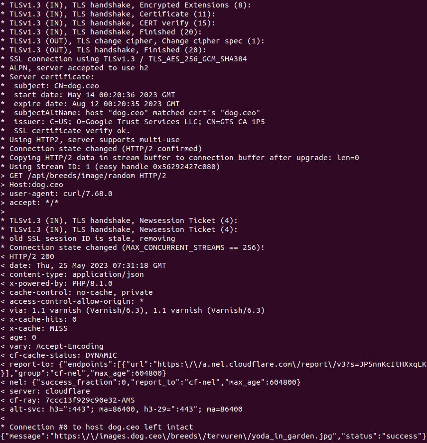

# Сервисы

- nginx
- random-dog: обращается по публичному api к https://dog.ceo/dog-api/, считывает путь к случайной картинке собаки и парсит его в название породы этой собаки. Далее при помощи простого приложения на Flask эта порода отоборажается в браузере

В результате на страничке должна отобразиться надпись "Example of random dog breed : ..."

# Запуск

- Запускаем minikube `minikube start --memory=4096`
- Создаём сертификаты и секрет через `bash k8s/mtls/create_certs.sh`
- Проверяем, что curl запрос с сертификатами работает через `bash k8s/mtls/request.sh`. Нужно получить следующий вывод:

- Запускаем  `./run.sh`, внитри которого происходят следующие действия:
    1. Скачиваем istio
    2. Применяем проксирование через istio для дефолтного namespace
    3. Запускаем 2 сервиса, и также управление трафиком с ingress и egress
- Копируем EXTERNAL-IP из `kubectl get service istio-ingressgateway -n istio-system`
- Переходим в браузере по адресу EXTERNAL-IP. Можно обновлять страничку и видеть как меняются предложенные породы собак

# Очистка окружения
`./clear.sh`
